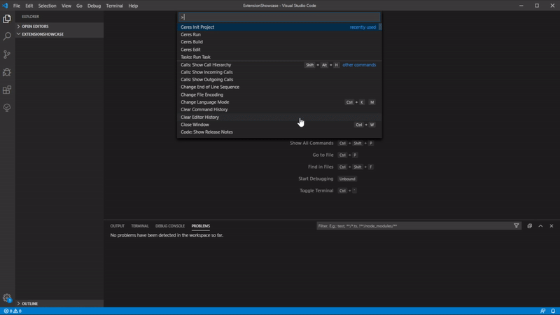
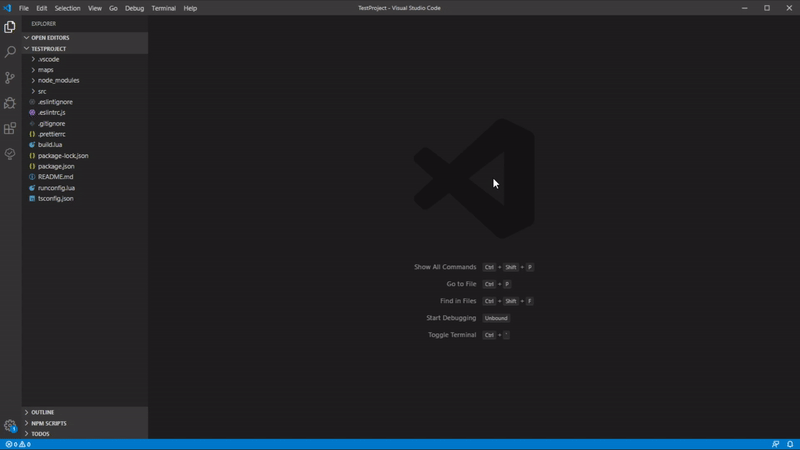
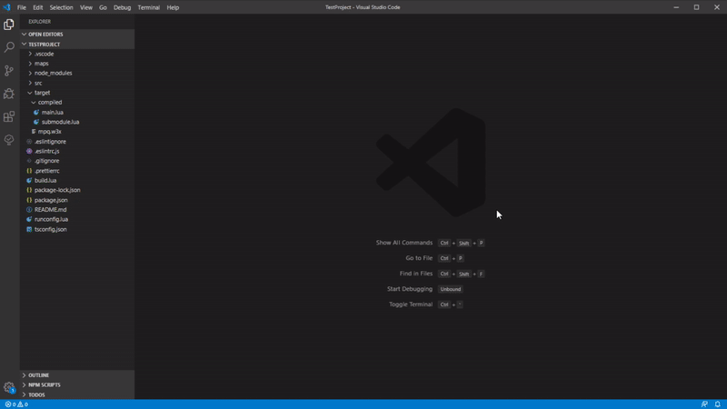
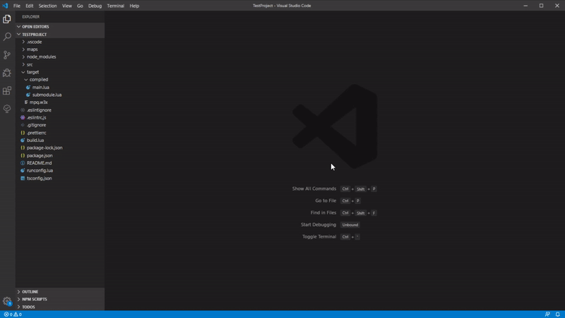

## Features

This extension is created to simplify the usage of Ceres while developing inside of VSCode.

#####Current Version Support :
1. **Ceres Init Project**:
    - Implements a fast way to initialize a new project.
    - Current project list is based on ceres template project from github.
        - Current project list: ```["ceres-lua-template", "ceres-ts-template", "ceres-ts-cerrie-template"]```
    - *(warn)* Make sure to use this command in a parent directory as it will create the project dir for you.

2. **Ceres Build**:
    - Basic implementation of the ```Ceres build -- --map map.w3x --output mpq```
    - ```/maps``` folder enum. Enumerates the maps inside ```/maps``` and create a list picker so u dont need to type the name of the map for each build.
    - Output list picker for ```mpq, dir, script```
    - Compile Typescript to lua
    
3. **Ceres Run**:
    - Implements Ceres Build in the workflow.
    - After a succesfull build opens ```Warcraft III.exe``` with the outputed build map.
    - Original ```runconfig.json``` in your ceres project is not required here as the opening game step is managed fully by the extension.
    
4. **Ceres Edit**:
    - Implements a quick way to edit the w3x maps from ```/maps``` folder by opening them in the world editor.
    - ```/maps``` folder enum. Enumerates the maps inside ```/maps``` and create a list picker so u dont need to type the name of the map.
    

## Requirements

U need to have a path to Ceres in **$PATH**

**Typescript**:
    - Npm package manager to install dependencies for a ts project

## Extension Settings

This extension contributes the following settings:

* `ceres.warcraft3.game.path`: path to your warcraft 3 executable.
* `ceres.warcraft3.game.args`: custom arguments for warcraft 3 launchtime.
* `ceres.warcraft3.game.autoclose`: Auto close the game during Ceres run execution.
* `ceres.warcraft3.editor.path`: path to your world editor executable.
* `ceres.warcraft3.editor.args`: custom arguments for world editor launchtime.

If you are using the extension with a Typescript project not initialized by the extension, you need to specifie a custom setting in ```.vscode/settings.json```
```json
{
  "ceres.project.lang": "ts"
}
```

## Known Issues

* No user feedback during commands execution

## Release Notes

### 1.0.0

Initial release of W3-Ceres